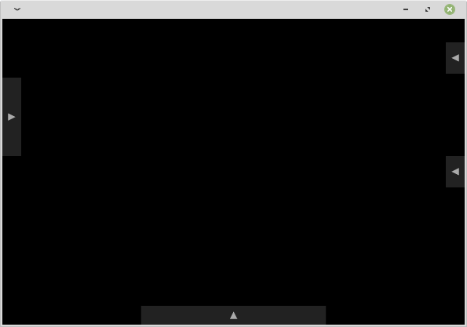
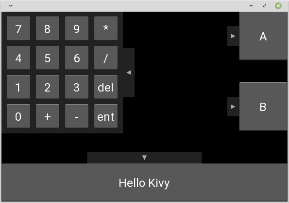

# KXDrawer

[Youtube](https://www.youtube.com/watch?v=kXR0Bh5cgrw)(outdated. replace `AKDrawer` with `KXDrawer` in your brain)  



## Installation

```
pip install git+https://github.com/gottadiveintopython/kivyx.uix.drawer#egg=kivyx.uix.drawer
```

## LICENSE

MIT

## Test Environment

- CPython3.8.12 + Kivy2.0.0
